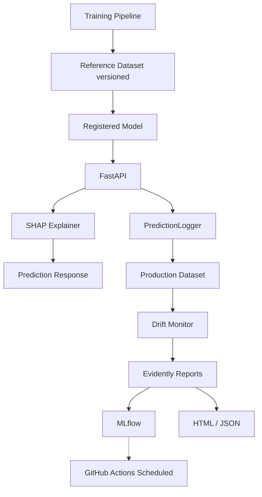
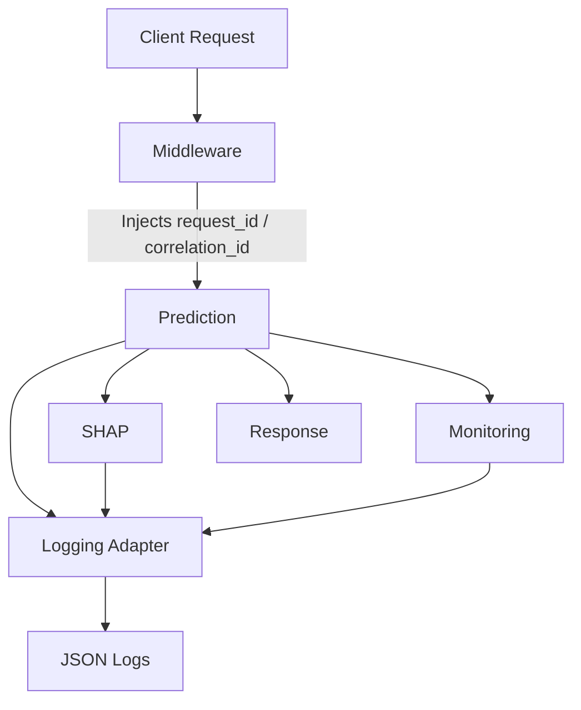

# Haett MLOps Internship Assessment - Churn Prediction Pipeline

This project is an end-to-end Machine Learning pipeline that predicts user churn for a healthy meal delivery platform. It generates realistic synthetic data, engineers business-relevant features, trains multiple ML models (Random Forest, XGBoost, etc.) using MLflow for tracking, and serves predictions via a FastAPI service wrapped in Docker.

## 🚀 Features

- **Realistic Synthetic Data Simulator:** Generates realistic usage histories, completely avoiding data leakage through strict temporal splitting (Jan-May for features, June for churn).
- **Automated Feature Engineering:** 17 advanced features including engagement decay, ordering consistency, and meal swap frequencies.
- **MLflow Tracking:** Automates logging of model parameters, metrics (F1, ROC-AUC), and artifacts.
- **Rules-Based Recommendation Engine:** Maps predicted High-Risk users to actionable business strategies (e.g., automated discounts, customer support escalation).
- **FastAPI Backend:** Fully documented API using OpenAPI (Swagger UI).
- **Fully Dockerized:** Easily deploy the API and MLflow server with a single command.
- **Comprehensive Test Suite:** 31 tests via `pytest` ensuring model robustness and API validation.

---

## 🛠️ Installation & Setup

### Option 1: Docker (Recommended)

The easiest way to run this project is via Docker Compose, which spins up both the FastAPI application and the MLflow Tracking Server.

1. Clone the repository:
   ```bash
   git clone https://github.com/X377AAHIL/haett_assignment.git
   cd haett_assignment
   ```

2. Build and start the containers:
   ```bash
   docker compose build
   docker compose up -d
   ```

3. Access the services:
   - **FastAPI / Swagger Docs:** [http://localhost:8000/docs](http://localhost:8000/docs)
   - **MLflow Tracking UI:** [http://localhost:5001](http://localhost:5001)

### Option 2: Local Python Environment

If you prefer to run it locally without Docker:

1. Clone the repository:
   ```bash
   git clone https://github.com/X377AAHIL/haett_assignment.git
   cd haett_assignment
   ```

2. Create a virtual environment and install dependencies:
   ```bash
   python -m venv venv
   source venv/bin/activate  # On Windows use: venv\Scripts\activate
   pip install -r requirements.txt
   ```

3. Generate data and train the model (if you want to reproduce it):
   ```bash
   python data/generate_synthetic_data.py
   python src/model_training.py
   ```

4. Start the FastAPI server locally:
   ```bash
   python -m uvicorn api.main:app --host 0.0.0.0 --port 8000
   ```

---

## 🤖 Continuous Integration (GitHub Actions)

This project uses **GitHub Actions** to enforce a professional standard for code quality and correctness. 

The CI workflow configuration is located at `.github/workflows/ci.yml`.

Whenever code is **pushed to the `main` branch** or a **Pull Request is opened**, the pipeline automatically runs the following steps in parallel across Python 3.10 and 3.11:
1. **Dependency Installation & Caching:** Installs all required packages and caches pip dependencies and Docker layers for lightning-fast execution.
2. **Code Formatting (`Black`):** Enforces PEP8 compliant code style formatting.
3. **Linting (`Ruff`):** Performs ultra-fast linting to catch syntax errors and maintain code quality.
4. **Unit Testing (`pytest`):** Runs the full 31-test test suite and uploads the `pytest.xml` results as an artifact.
5. **Docker Build Verification:** Attempts to build the `Dockerfile` using Docker Buildx to guarantee that the production image will always successfully compile without errors.

The workflow will fail immediately if any of these steps error out, ensuring that the `main` branch always remains production-ready. 

---

## 🧠 Model Explainability (SHAP)

To build trust and provide transparency, this project natively integrates **SHAP (SHapley Additive exPlanations)**. 

SHAP is the state-of-the-art framework for interpreting machine learning models. It decomposes the model's prediction into additive feature impacts, telling us *exactly* how much each feature contributed to the final churn probability and in which direction (increasing or decreasing risk).

### How it Works:
1. **Model Agnostic Detection**: The system automatically detects the model type during training and initializes the most efficient explainer (e.g., `TreeExplainer` for XGBoost).
2. **MLflow Integration**: When `src/model_training.py` finishes, it automatically generates global explanations (Summary Plot, Bar Plot) and local explanations (Waterfall plot for the highest risk user). These plots, along with a `feature_importance.json` file, are logged directly into MLflow under the `explainability/` artifact path.
3. **Real-time API Explanations**: The `ShapExplainer` is cached in memory when the FastAPI server starts. You can request real-time explanations by passing `"explain": true` to the `/predict` endpoint. It returns human-readable feature impacts without significantly degrading API response times.

---

## 📈 Data Drift Monitoring (Evidently AI)

Why monitor? In production, models degrade silently because user behavior changes (Data Drift) or the relationship between features and the target changes (Concept Drift). Because ground truth labels (churn) aren't immediately available, we monitor **Prediction Probability Drift** to detect when the model starts acting differently.

This project natively integrates **Evidently AI** with a robust, production-grade architecture:



### How to use it:
- Every prediction via `/predict` is asynchronously appended to a local parquet dataset using the `PredictionLogger`.
- A GitHub Action runs daily (or manually via `src/run_monitoring.py`) to compare the **Reference Dataset** (saved during training) with the **Production Dataset**.
- Rich HTML dashboards and JSON metrics are generated and uploaded directly to **MLflow** under the `monitoring/` hierarchy.
- You can fetch live metrics via `GET /monitor/status` or manually trigger reports via `POST /monitor/drift`.

---

## 🔬 Observability & Tracing

This project features a production-grade observability layer ensuring end-to-end traceability across all subsystems.



### Key Features
1. **Request Tracing**: A FastAPI middleware generates a unique `request_id` and `correlation_id` for every incoming request. Using Python's `contextvars`, these IDs are propagated seamlessly across all components (Feature Engineering, Prediction, Explainability, Monitoring) and automatically injected into every log entry via a custom `LoggerAdapter`.
2. **Structured JSON Logging**: Powered by `python-json-logger`, all logs are emitted as structured JSON, making them immediately compatible with tools like Datadog, ELK, or CloudWatch.
3. **Strict Logging Policy**:
   - `INFO`: Application startup/shutdown, prediction success, monitoring runs.
   - `WARNING`: Missing expected features, low sample counts.
   - `ERROR`: Prediction or subsystem failures.
   - `DEBUG`: Internal timings, feature engineering details.
   - **No Sensitive Data**: Raw user vectors and PII are strictly omitted from logs.
4. **Log Rotation**: Automated rotating file handlers (`api.log`, `training.log`, `prediction.log`, `monitoring.log`) prevent unlimited disk growth.
5. **In-Memory Metrics**: Latency and usage metrics are tracked live and exposed via `GET /metrics`.
6. **Graceful Exception Handling**: A unified `ApplicationError` hierarchy intercepts failures globally, returning sanitized JSON responses without leaking stack traces.

### Endpoints
- `GET /health`: Lightweight liveness probe.
- `GET /ready`: Deep readiness probe checking model loading, SHAP init, reference datasets, and config availability.
- `GET /version`: Application and model metadata (including `git_commit`).
- `GET /metrics`: In-memory runtime metrics (e.g., `prediction_count`, `average_latency`).
- `GET /system/info`: Global ecosystem summary (MLflow/SHAP/Monitoring status).

---

## 🔍 API Usage Example

You can query the `/predict` endpoint to get the churn probability, risk level, and a dynamic business recommendation.

**Request:**
```bash
curl -X POST http://localhost:8000/predict -H "Content-Type: application/json" -d '{
  "avg_items_per_order": 2.5,
  "avg_order_value": 450,
  "avg_rating": 4.2,
  "coupon_usage_rate": 0.3,
  "days_since_last_order": 15,
  "days_to_subscription_expiry": 10,
  "engagement_decline": 0.2,
  "engagement_score": 2.0,
  "is_premium": 1,
  "meal_swap_frequency": 0.1,
  "order_consistency": 5.2,
  "order_trend_slope": -0.5,
  "orders_last_30_days": 2,
  "rating_trend": -0.3,
  "subscription_duration_days": 120,
  "support_ticket_count": 1,
  "total_lifetime_orders": 35
}'
```

**Response:**
```json
{
  "churn_probability": 0.5286,
  "risk_level": "Medium",
  "recommendation": {
    "action": "Monitor closely and send a satisfaction survey",
    "reason": "This user shows moderate churn risk. A satisfaction survey can identify potential issues early before they escalate."
  }
}
```

---

## ✅ Testing

To run the full test suite locally:
```bash
pytest tests/ -v
```
*(All 31 tests should pass successfully)*
