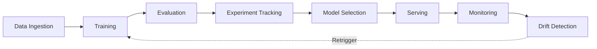
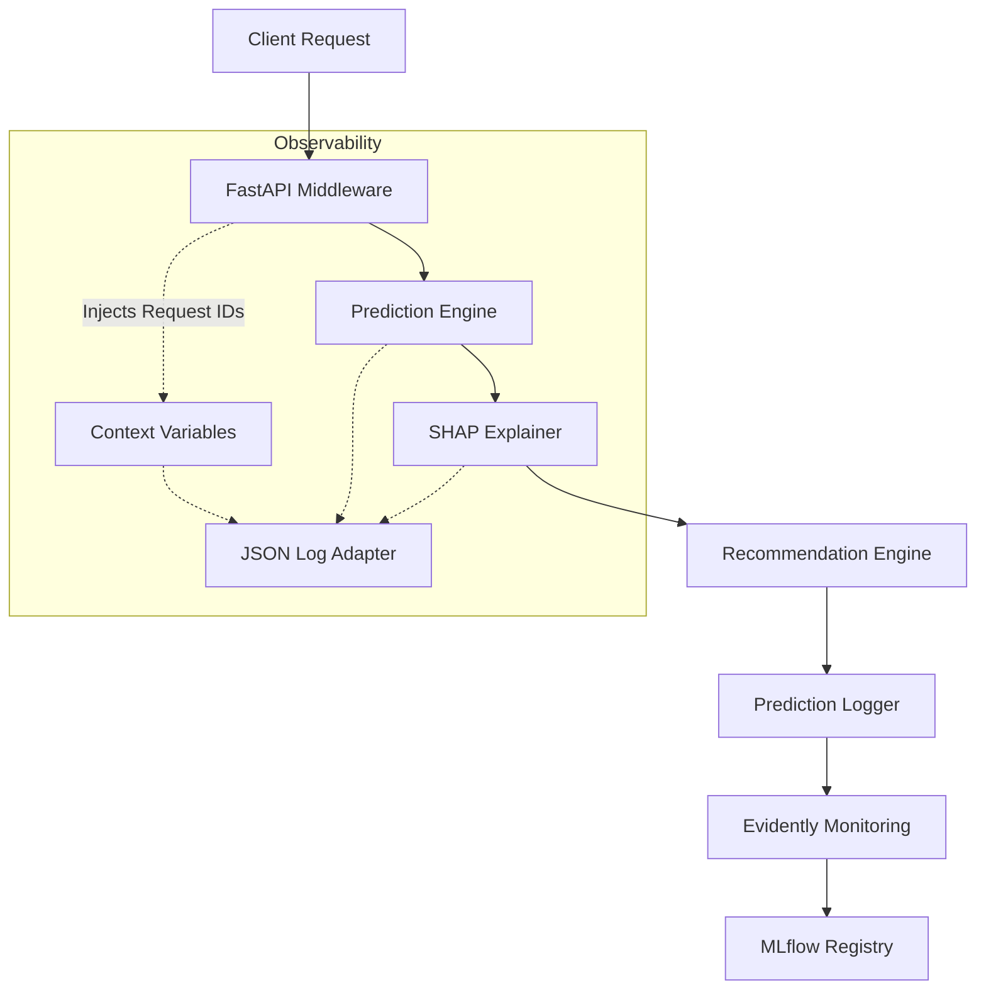
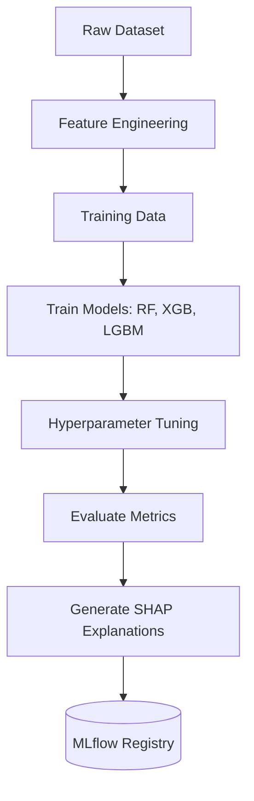
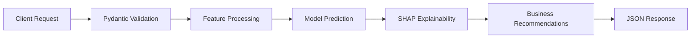
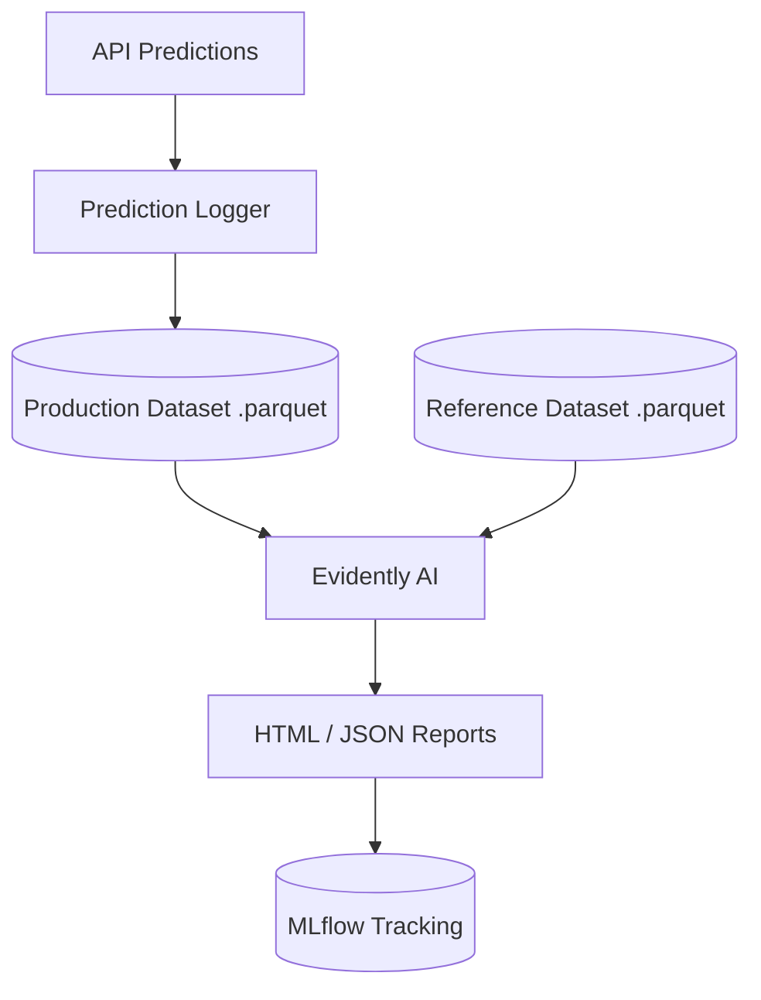
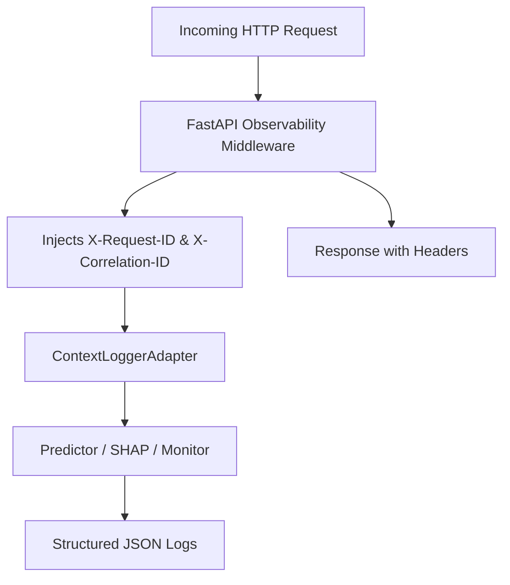

<div align="center">
  <h1>🚀 Haett Churn Prediction MLOps Platform</h1>
  <p><strong>An end-to-end, production-ready MLOps platform for user churn prediction.</strong></p>
</div>

<div align="center">
  
  
  
  
  
  
  
  
</div>

---

## 📖 Project Overview

Haett is a growing meal delivery platform. Identifying users who are highly likely to churn before they actually leave allows the business to proactively offer targeted interventions (such as discounts, personalized recommendations, or wellness check-ins) to significantly improve customer retention and maximize lifetime value.

This project goes beyond a simple Jupyter Notebook model. It establishes a complete MLOps lifecycle featuring automated feature engineering, model training and tracking via MLflow, robust model explainability via SHAP, production monitoring via Evidently AI, comprehensive system observability, and a highly scalable serving layer built with FastAPI and Docker.



## ✨ Key Features

- **End-to-End ML Pipeline**: Automated extraction, feature engineering, and model training.
- **Feature Engineering**: Dynamic aggregation of order history, coupon usage, and meal swap frequencies using a reproducible Scikit-Learn transformer.
- **Model Comparison**: Automated training and evaluation of Logistic Regression, Random Forest, XGBoost, and LightGBM models.
- **MLflow Experiment Tracking**: Versioned tracking of hyperparameters, evaluation metrics (F1, ROC-AUC), and model artifacts.
- **SHAP Explainability**: Global and local explainability built inherently into both the training process and the inference API.
- **Data Drift Monitoring**: Scheduled and manual data drift and data quality monitoring powered by Evidently AI.
- **Production Observability**: Fully structured JSON logging, dynamic UUID request tracing, in-memory latencies, and unified application exception handling.
- **FastAPI Prediction API**: High-performance, asynchronous REST API delivering millisecond predictions and business recommendations.
- **Docker Support**: Containerized architecture for seamless cloud deployment and horizontal scaling.
- **GitHub Actions CI**: Automated Continuous Integration workflows for testing, linting, and scheduled monitoring checks.
- **Automated Testing**: Robust test suite leveraging `pytest` to validate core ML components and API health.

## 🏗️ System Architecture



## 🛠️ Technology Stack

| Category | Technologies |
| :--- | :--- |
| **Programming** | Python 3.11, Pandas, NumPy |
| **Machine Learning** | Scikit-Learn, XGBoost, LightGBM |
| **Backend / Serving** | FastAPI, Uvicorn, Pydantic |
| **MLOps / Tracking** | MLflow |
| **Monitoring** | Evidently AI |
| **Explainability** | SHAP |
| **DevOps / Deployment** | Docker, Docker Compose |
| **CI / CD** | GitHub Actions |
| **Testing** | Pytest, TestClient |
| **Observability** | python-json-logger, ContextVars |

## 📂 Repository Structure

```text
haett_assignment/
├── .github/
│   └── workflows/
│       ├── ci.yml               # Automated tests & linting
│       └── monitoring.yml       # Scheduled Evidently AI drift reports
├── api/
│   ├── main.py                  # FastAPI application entrypoint
│   └── schemas.py               # Pydantic validation models
├── artifacts/
│   ├── monitoring/              # Evidently AI HTML and JSON reports
│   └── shap/                    # SHAP explainability plots
├── config/
│   ├── monitoring.yaml          # Evidently AI configurations
│   └── observability.yaml       # Logging and metrics configurations
├── data/
│   ├── raw/                     # Original CSV datasets
│   ├── processed/               # Parquet monitoring datasets
│   └── generate_synthetic_data.py
├── models/                      # Serialized .joblib models & transformers
├── src/
│   ├── explainability/          # SHAP integration modules
│   ├── monitoring/              # Evidently AI prediction loggers & reporters
│   ├── observability/           # JSON loggers, tracers, and health checks
│   ├── data_preparation.py      # Data loading and merging
│   ├── feature_engineering.py   # Scikit-Learn custom transformers
│   ├── model_training.py        # MLflow model training pipelines
│   ├── predict.py               # Core inference engine
│   └── recommendations.py       # Rule-based business logic
├── tests/                       # Pytest test suites
├── Dockerfile                   # Production container definition
├── docker-compose.yml           # Local multi-container orchestration
└── requirements.txt             # Project dependencies
```

## 🧠 Machine Learning Pipeline



The ML Pipeline natively evaluates multiple tree-based algorithms and linear baselines, ultimately selecting the best performing model (typically XGBoost) based on the **F1 Score** to properly balance precision and recall.

## 🚀 Installation & Setup

### Local Installation
1. **Clone the repository:**
   ```bash
   git clone https://github.com/X377AAHIL/haett_assignment.git
   cd haett_assignment
   ```
2. **Create a virtual environment:**
   ```bash
   python3 -m venv venv
   source venv/bin/activate
   ```
3. **Install dependencies:**
   ```bash
   pip install -r requirements.txt
   ```

### Running the Project

**1. Generate Synthetic Data**
```bash
python data/generate_synthetic_data.py
```

**2. Train the Model**
```bash
python -m src.model_training
```

**3. Start the API**
```bash
uvicorn api.main:app --reload --host 0.0.0.0 --port 8000
```

### Docker Usage
To easily launch the entire stack (API + MLflow UI) via Docker Compose:
```bash
docker-compose up --build
```
- API is accessible at: `http://localhost:8000`
- Swagger Docs: `http://localhost:8000/docs`
- MLflow UI: `http://localhost:5001`

*(Placeholder for Docker Container Screenshot)*

## 📡 API Documentation

The inference pipeline takes raw user metadata, passes it through the exact same feature engineering transformer used during training, predicts the churn risk, and computes local SHAP explanations for transparency.



### Endpoint: `POST /predict`
**Request Body (JSON):**
```json
{
  "avg_items_per_order": 2.5,
  "avg_order_value": 450,
  "avg_rating": 4.2,
  "coupon_usage_rate": 0.3,
  "days_since_last_order": 15,
  "days_to_subscription_expiry": 10,
  "engagement_decline": 0.2,
  "engagement_score": 25.0,
  "is_premium": 1,
  "meal_swap_frequency": 0.1,
  "order_consistency": 5.2,
  "order_trend_slope": -0.5,
  "orders_last_30_days": 3,
  "rating_trend": -0.3,
  "support_ticket_count": 1,
  "total_lifetime_orders": 20
}
```

**Successful Response (200 OK):**
```json
{
  "churn_probability": 0.7431,
  "risk_level": "High",
  "recommendation": {
    "action": "Immediate Intervention",
    "description": "Send high-value retention offer and personal check-in."
  },
  "top_factors": [
    {
      "feature": "engagement_decline",
      "impact_score": 0.125,
      "direction": "increases_risk",
      "description": "Recent drop in engagement compared to historical average"
    }
  ]
}
```

*(Placeholder for Swagger UI Screenshot)*

## 🔬 MLflow Tracking

MLflow acts as the source of truth for all ML experiments.
- **Experiment Tracking**: Automatically logs hyperparameter grids, F1 scores, ROC-AUC metrics, and precision-recall metrics.
- **Artifacts**: Serialized models (`.joblib`), data transformers, and global SHAP summary plots are stored as artifacts against specific run IDs.

*(Placeholder for MLflow Dashboard Screenshot)*

## 🔍 Explainability

Explainability is a first-class citizen in this repository. We use **SHAP (SHapley Additive exPlanations)** because it provides theoretically sound, consistent feature attributions.

- **Global Explainability (Training)**: The pipeline generates SHAP Summary and Bar plots directly into MLflow and the `artifacts/shap` directory to explain model behavior at scale.
- **Local Explainability (Inference)**: The API returns dynamic `top_factors` driving the prediction for that specific user, allowing customer success teams to understand *why* an alert was generated.

*(Placeholder for SHAP Summary Plot Screenshot)*
*(Placeholder for SHAP Waterfall Plot Screenshot)*

## 📊 Monitoring (Evidently AI)

Models degrade over time. We integrated **Evidently AI** to actively monitor for concept and data drift.



- **Prediction Logger**: The API silently logs all inference inputs and outputs asynchronously.
- **Drift Detection**: Analyzes drift between the training/validation data (Reference) and the incoming inference data (Production).
- **Reports**: Triggers detailed HTML visualizations and JSON metric logs.

*(Placeholder for Evidently Drift Report Screenshot)*

## 🔭 Observability

Operating an MLOps pipeline blindly is dangerous. This repo implements comprehensive structured observability:



- **Structured JSON Logging**: All logs are emitted as JSON, injecting `request_id`, `correlation_id`, `model_version`, and `service_name` dynamically via `contextvars`.
- **Health Endpoints**:
  - `GET /health`: Ultra-lightweight liveness ping.
  - `GET /ready`: Deep readiness check validating Model loaded state, SHAP init, Config maps, and Reference datasets.
  - `GET /version`: Fetches Python, App, and Git commit metadata.
  - `GET /metrics`: In-memory runtime metrics exposing `prediction_count`, `average_latency`, and exception counts.
- **Exception Hierarchy**: Unified `ApplicationError` safely intercepts crashes without leaking internal Python stack traces to clients.

## ⚙️ GitHub Actions CI

Continuous Integration ensures code quality and drift safety.
- **`ci.yml`**: Runs Pytest, lints code, and validates Docker builds on every Push and Pull Request to `main`.
- **`monitoring.yml`**: Automatically triggers an Evidently AI data drift report on a cron schedule, generating reports without manual intervention.

*(Placeholder for GitHub Actions Screenshot)*

## 🧪 Testing

The repository uses `pytest` for robust validation:
- **API Tests**: Validates FastAPI responses, input validation, and expected HTTP status codes.
- **ML Tests**: Validates Scikit-Learn transformers and prediction pipelines.
- **Monitoring Tests**: Confirms the prediction logger accurately appends data to parquet storage.
- **Observability Tests**: Confirms that tracing headers are properly injected into both logs and HTTP responses.

## 📐 Design Decisions

- **Why FastAPI?**: Native async support, incredible performance, and auto-generated OpenAPI schemas make it the industry standard for Python ML serving.
- **Why XGBoost?**: Gradient Boosted Trees consistently outperform deep learning models on tabular, structured dataset topologies (like user churn) with significantly less compute overhead.
- **Why SHAP over LIME?**: SHAP offers mathematical guarantees around consistency and local accuracy that LIME lacks, which is critical when business decisions (e.g., offering discounts) are made based on the explanations.
- **Why Evidently AI?**: Purpose-built for MLOps drift detection. It operates locally on Pandas DataFrames without requiring a complex, heavy backend infrastructure.
- **Why JSON Logging?**: Flat text logs are difficult to parse in cloud environments. JSON logs enable instant searching and dashboards in tools like Datadog or AWS CloudWatch.
- **Why ContextVars for Tracing?**: Passing `request_id` explicitly down through every Python function pollutes the codebase. `contextvars` enables global tracing invisibly.

## 🔮 Future Improvements

While this is a production-ready baseline, enterprise scaling would require:
1. **Cloud Deployment**: Deploy the Docker image to AWS ECS, GCP Cloud Run, or a Kubernetes cluster.
2. **Prometheus & Grafana**: Connect the `/metrics` endpoint to Prometheus for robust alerting and visualization.
3. **Authentication**: Implement JWT or API Key authentication on the FastAPI routes.
4. **Automated Model Retraining**: Trigger the training pipeline automatically when Evidently AI detects significant data drift.
5. **Feature Store**: Migrate local CSV/Parquet data loading to a managed feature store (like Feast or Hopsworks) for lower latency inference.
6. **Streaming Predictions**: Introduce Apache Kafka for asynchronous, batch prediction processing.

---

### License
This project is licensed under the MIT License. See the [LICENSE](LICENSE) file for details.

### Acknowledgements
Built as an end-to-end demonstration of mature MLOps engineering principles.
